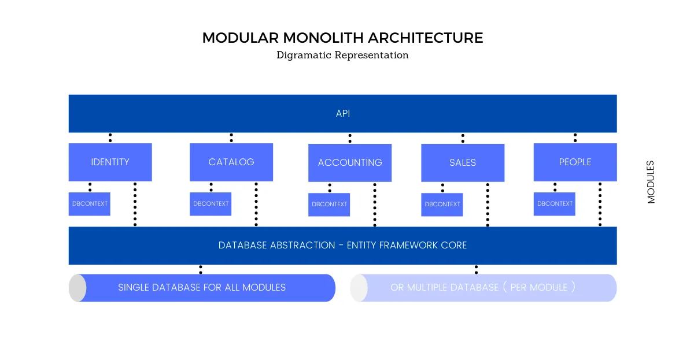

# FreeFlix - A Proof of Concept Movie Database

## How to run it on your machine
1. Clone the project(master branch).
2. Make sure the `API` project is the startup project.
3. Start the solution. It will create and seed the `FreeFlixDatabase` on `(localdb)\MSSQLLocalDB`.
4. The Swagger UI will open.

## About the chosen pattern "Modular Monolith"

This is a solution that is built to contain multiple modules where-in each of the modules implements a variation of Clean / Onion Architecture.
It mimics Microservices yet keeps the simplicity and goodness of Monoliths.

Addition of new modules will not change the existing code of other modules. It fits the Open/Closed Principle

Here is an illustration:

The main idea here is to build a better Monolith Solution.

- **API / Host:** A very thin Rest API / Host Application that is responsible for registering the controllers/services of other modules into the service container.
- **Modules:** A logical block of the business unit. For example, Sales. Everything that is related to Sales can be found here.
- **Shared Infrastructure:** Application-specific interfaces and implementations are found here for other modules to consume. This includes Middlewares, Data Access providers, and so on.
- **Database:** You have the flexibility to use multiple databases, i.e one database per module.

You can see that there is not much deviation from a standard Monolith implementation. The basic recipe is to split your application into multiple smaller applications/modules and make them follow clean architecture principles.

Check the comments on top of the .csproj files for the purposes of the projects.

Read more about this pattern on:
[https://codewithmukesh.com/blog/modular-architecture-in-aspnet-core/](https://codewithmukesh.com/blog/modular-architecture-in-aspnet-core/)